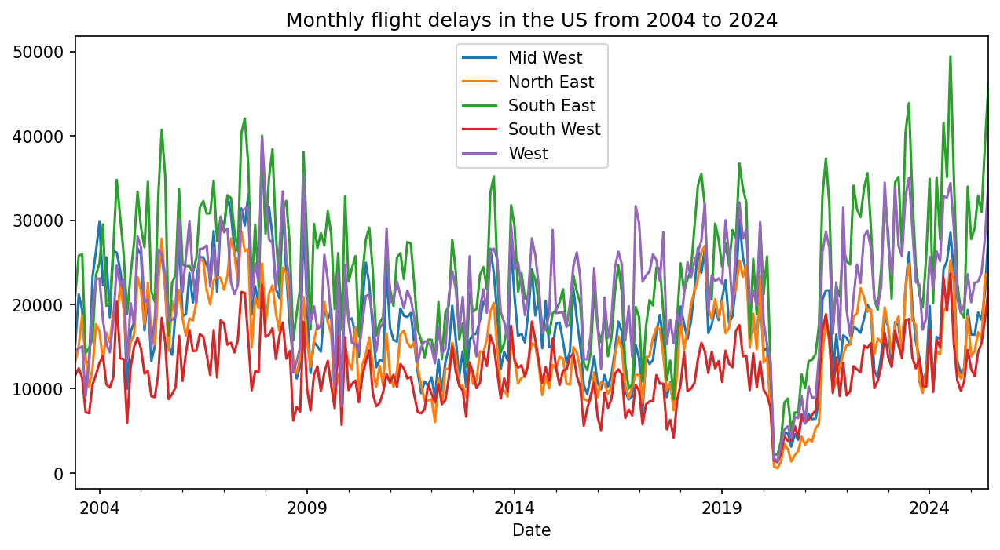
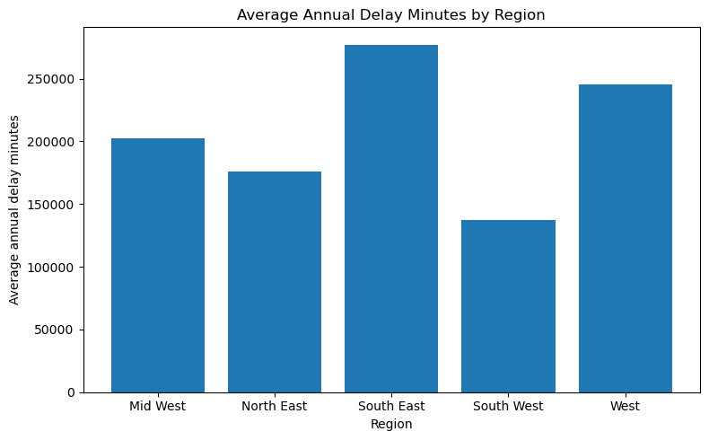
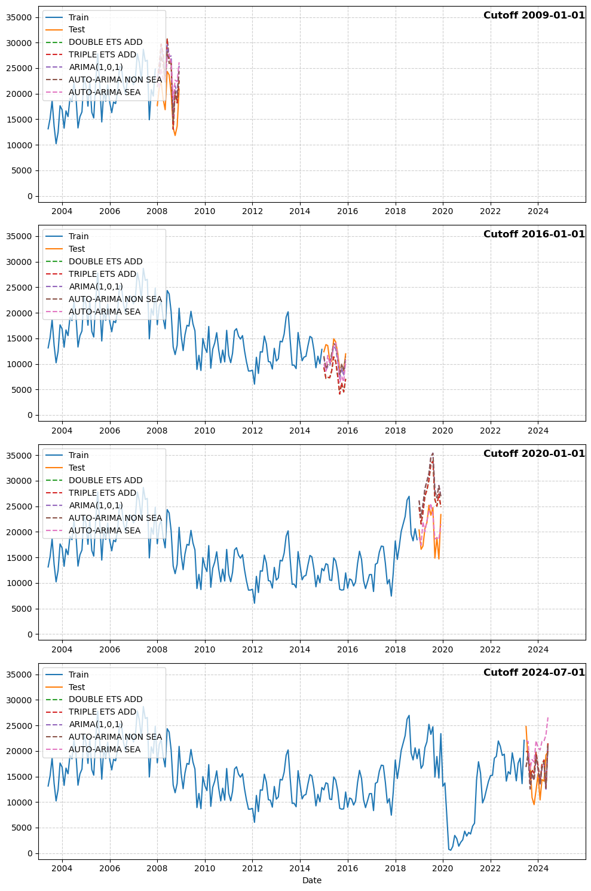

# TimeFlight


Regional flight delay forecasting framework built on 21 years of Bureau of Transportation Statistics data (407,721 rows, 2004-2024). Maps U.S. airports into five regions and compares five classical time-series models (Seasonal Auto-ARIMA, Auto-ARIMA, ARIMA(1,0,1), Double ETS, Triple ETS) across four historical cutoff windows spanning pre-recession, post-recovery, COVID disruption, and recent high-volatility periods. Seasonal Auto-ARIMA outperforms all baselines with the lowest RMSE in 4 of 5 regions, reliably flagging high-delay periods 6 months in advance. Designed to support crew scheduling, maintenance planning, and traffic management decisions in a $33B annual delay market.

[Portfolio](https://adarsh-rai.com)



Monthly flight delay counts across five U.S. regions from 2004 to 2024. South East (green) consistently produces the highest delays with the most volatility. The COVID collapse near 2020 drops all regions to near zero before a sharp recovery.

## The Problem

Flight delays cost the U.S. aviation system over $33 billion annually. Most forecasting research in this domain reaches for deep learning approaches that require massive datasets, GPU infrastructure, and produce forecasts that are difficult to explain to the operations teams that need them. TimeFlight tests the opposite position: classical statistical models with rigorous multi-cutoff evaluation can produce operationally useful directional signals from historical delay volumes alone. No weather feeds, no scheduling data, no exogenous variables. The constraint is deliberate. It establishes a lower bound on what univariate forecasting can deliver at the regional level.

## Dataset

| Property | Value |
|---|---|
| Source | BTS Airline On-Time Performance, Cause of Delay |
| Rows | 407,721 |
| Columns | 21 (year, month, carrier, airport, delay causes, flight counts) |
| Granularity | Monthly, airport-level |
| Time span | 2004-2024 (21 years) |
| Target variable | `arr_del15` (flights delayed 15+ minutes per month) |
| Regional aggregation | 5 regions via manually curated airport-code mapping |
| Observations per region | ~250 monthly data points |



Regional delay burden varies sharply. South East averages 275,000 delay minutes per year, driven by hub congestion at ATL, MIA, and CLT combined with thunderstorm season. South West sits at 137,000. This disparity affects model evaluation directly because high-volume, high-variance regions produce larger absolute errors even when the model's relative performance is strong.


Strong seasonal patterns are visible across all regions. June through August produces the highest delays, with South East in July being the single worst month-region combination in the dataset. September drops sharply as summer storm patterns subside. December shows a secondary spike from holiday traffic. These seasonal patterns are exactly what the m=12 seasonal component in SARIMA is designed to capture.

## Models

| Model | Type | Captures |
|---|---|---|
| Double ETS (Additive) | Exponential smoothing | Level + seasonality |
| Triple ETS (Additive) | Exponential smoothing | Level + trend + explicit seasonal period |
| ARIMA(1,0,1) | Box-Jenkins | Fixed AR(1) + MA(1), no seasonal component |
| Auto-ARIMA (Non-Seasonal) | Stepwise search | Automated (p,d,q) order selection |
| Seasonal Auto-ARIMA | Stepwise SARIMA | Automated (p,d,q)(P,D,Q)[12] with m=12 |

ARIMA(1,0,1) is included as a deliberate weak baseline. It has no seasonal component and cannot capture summer peaks or winter spikes. If it outperforms a seasonal model on a given split, the seasonal model's fit has a problem. The model registry is a Python dictionary, so adding a new model is a one-line change. Both statsmodels and pmdarima APIs run through the same evaluation loop with try/except wrapping for convergence failures.

## Evaluation

A single train/test split hides model instability, especially with structural breaks in the data. TimeFlight evaluates every model across four cutoff dates, each representing a different operational era:

| Cutoff | Era | What it tests |
|---|---|---|
| 2009-01-01 | Pre-recession | Older operational patterns, pre-schedule optimization |
| 2016-01-01 | Post-recovery | Modern operations after capacity adjustments |
| 2020-01-01 | COVID structural break | Collapse to near-zero traffic and sharp rebound |
| 2024-07-01 | Recent high-volatility | Smallest training window, most operationally realistic |

At each cutoff, models train on all data before the date and forecast 12 months ahead. That produces 5 models x 5 regions x 4 cutoffs = 100 model fits, evaluated on MAE, MSE, R², and Mean Error.



The 2020 cutoff is the stress test. Models trained entirely on pre-COVID patterns attempt to forecast a world where air traffic drops to near zero and then rebounds sharply. No univariate model handles this well, which is expected. The evaluation isn't designed to find a model that gets 2020 right. It's designed to find the model that's least wrong across all four windows.

## Results

| Region | Seasonal ARIMA | ARIMA(1,0,1) | Non-Seasonal ARIMA | ETS Models |
|---|---|---|---|---|
| Mid West | 4,075 | 7,309 | 6,309 | 10,909 |
| North East | 4,681 | 6,074 | 5,736 | 5,718 |
| South East | 7,523 | 6,928 | 7,950 | 10,247 |
| South West | 3,606 | 4,147 | 4,550 | 4,372 |
| West | 4,980 | 5,967 | 6,442 | 10,392 |


Seasonal Auto-ARIMA posts the lowest RMSE in 4 of 5 regions. The one exception is South East, where ARIMA(1,0,1) edges it out. South East has the highest absolute delay volume and the widest variance in the dataset, so the seasonal component has more noise to contend with. The fixed-order model predicts a flatter trajectory that happens to land closer to the mean.

ETS models perform worst across the board. Double and Triple ETS post RMSE values nearly double Seasonal ARIMA's in some regions (Mid West: 10,909 vs 4,075). Exponential smoothing without ARIMA's differencing and seasonal integration cannot handle the structural shifts in this dataset. R-squared values are near zero across all models, which is expected with COVID, severe weather events, and airline operational disruptions in the data. The forecasts are directional: they flag high-delay periods 6-12 months out for scheduling and staffing, not precise point predictions.

## Quick Start

```bash
git clone https://github.com/adarsh-rai-secure/flight-delay-forecasting.git
cd flight-delay-forecasting
pip install pandas numpy statsmodels pmdarima scikit-learn matplotlib seaborn
jupyter notebook "TimeFlight Code.ipynb"
```

The notebook runs end-to-end in approximately 2 minutes. No API keys, no external services. Data is sourced from BTS.

## Project Structure

```
flight-delay-forecasting/
├── TimeFlight Code.ipynb        # Full pipeline: 44 cells, EDA through model comparison
├── TimeFlight Final Report.pdf  # Methodology, results, discussion
├── TimeFlight Presentation.pdf  # Executive-level slide deck
├── README.md
├── docs/
│   ├── TimeFlight_Documentation.md
│   └── images/                  # Charts and visualizations
└── data/                        # BTS dataset
```

## Design Decisions

**Classical over deep learning.** With ~250 observations per region, classical models are both appropriate and interpretable. The project establishes a lower bound before reaching for complexity.

**Regional aggregation over airport-level.** Aggregating to five regions smooths airport-specific noise into a signal-to-noise ratio that ARIMA family models can learn from. Airport-level modeling would require a different approach entirely.

**Multi-cutoff over single split.** Four cutoff windows spanning different economic regimes. A single train/test split would hide instability, especially around COVID. 100 model fits across all combinations.

**No exogenous variables.** Deliberate constraint. If a Seasonal ARIMA using only historical delays can flag a high-delay period 6 months out, that's the baseline any more complex approach needs to beat.

**Resilient fitting.** Every model fit is wrapped in try/except so a convergence failure on one model or one region doesn't abort the pipeline. The evaluation loop runs to completion regardless.

## Limitations

- Univariate only. No weather, scheduling, traffic volume, or airline operational data as exogenous inputs.
- Regional granularity. Airport-level forecasts would require different aggregation and likely different model families.
- R-squared near zero across all models. Expected with structural breaks but limits point-prediction accuracy.
- No streaming or real-time pipeline. Batch analysis in a Jupyter notebook.
- Regional mapping is manually curated, not derived from FAA definitions.
- COVID structural break in 2020 degrades all models trained across that boundary.

## Team

Class project for Intro to AI at CMU Heinz College (Fall 2025). Three-person team: Adarsh Rai (EDA, regional aggregation, model selection), Ayushi Shah (problem framing, time-series modeling), Taiyuan Zhang (training, testing, visualization).

## License

MIT
